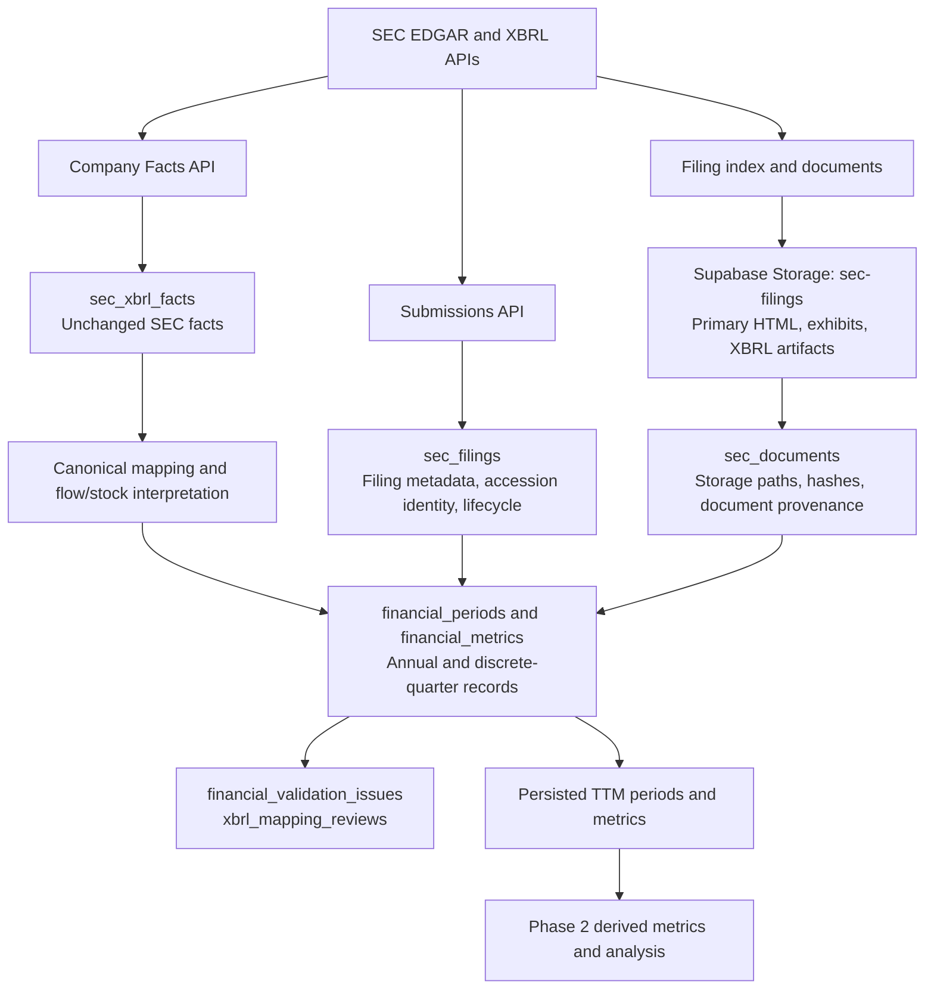

# InvestiCore Data-Layer Architecture



## Source and evidence layers

`sec_filings` is the accession-number source-of-record for SEC filing discovery, amendment relationships, processing state, and retries. The filing identity is unique by `(company_id, accession_number)`.

`sec_documents` contains only document metadata. The raw document itself is held in the private `sec-filings` Storage bucket at a deterministic path:

```text
{cik}/{form_type}/{accession_without_hyphens}/{filename}
```

## Raw structured-fact layer

`sec_xbrl_facts` is an immutable SEC Company Facts layer. It retains the original taxonomy, concept, value, unit, dimensions implied by the fact dates, fiscal metadata, form, filing date, accession number, and Company Facts source URL. Raw facts are never replaced with normalized or derived values.

The annual normalization scope is every distinct SEC annual report period available to the issuer, while the quarterly normalization scope is the latest eight 10-Q periods. The Company Facts response is fetched once per issuer, and every available raw fact in that response is persisted. Eight quarters support year-over-year comparisons; the persisted TTM calculation uses the latest four discrete quarters. Amendment preference prevents duplicate annual periods without discarding original raw facts.

## Normalization layer

`financial_periods` represents canonical annual, quarterly, and TTM windows. `financial_metrics` holds canonical InvestiCore values and their source filing/document, XBRL tag, metric kind, confidence, calculation method, and source periods.

For flow metrics, normalized quarters prefer a direct quarter fact, then reconstruct Q2/Q3 from YTD facts and Q4 from annual minus Q3 YTD. Stock metrics are point-in-time and are never YTD-subtracted.

## Validation and derived layer

Validation outcomes are stored independently in `financial_validation_issues`; unresolved mapping issues are stored in `xbrl_mapping_reviews`. Persisted TTM is the only Phase 1 derived layer. It uses the latest four discrete quarters and retains the contributing period and filing identifiers.

Phase 2 may build growth, margins, return metrics, and other analysis only from the normalized and persisted TTM layers. It must not overwrite SEC source facts or Phase 1 normalization provenance.